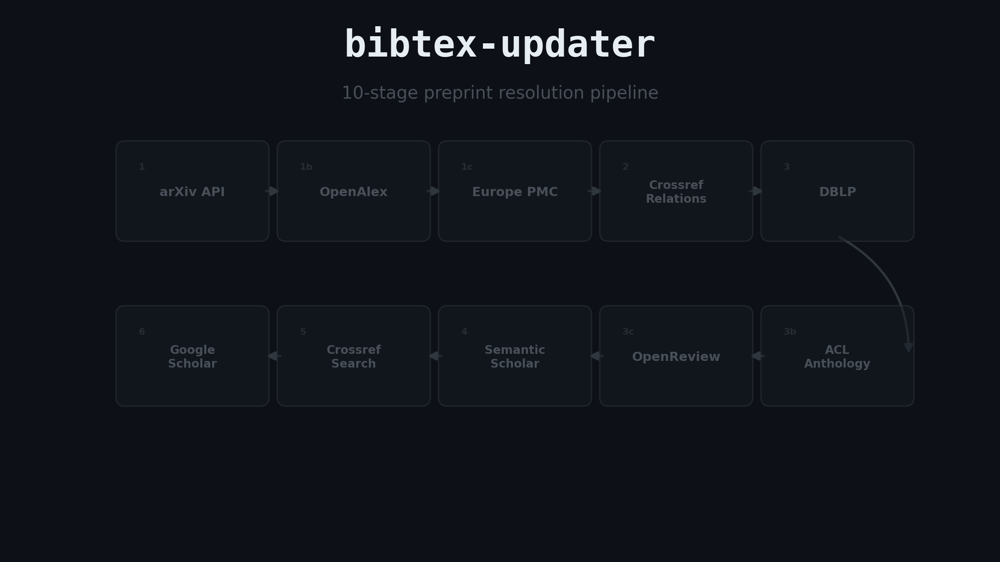
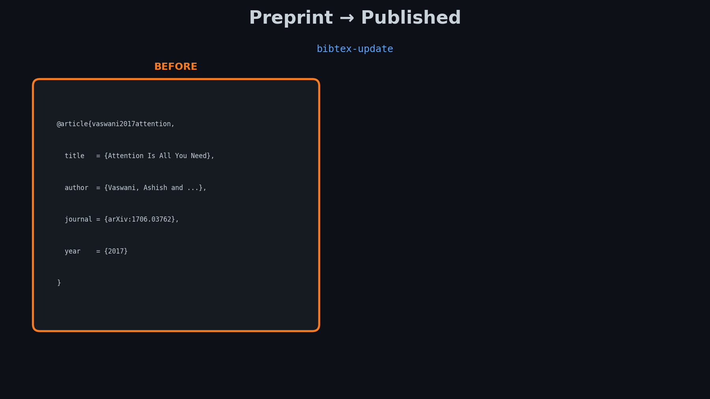
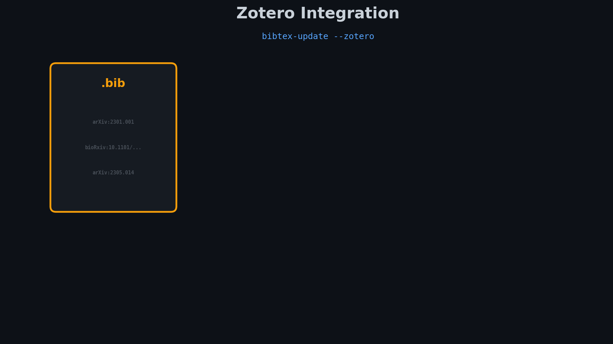
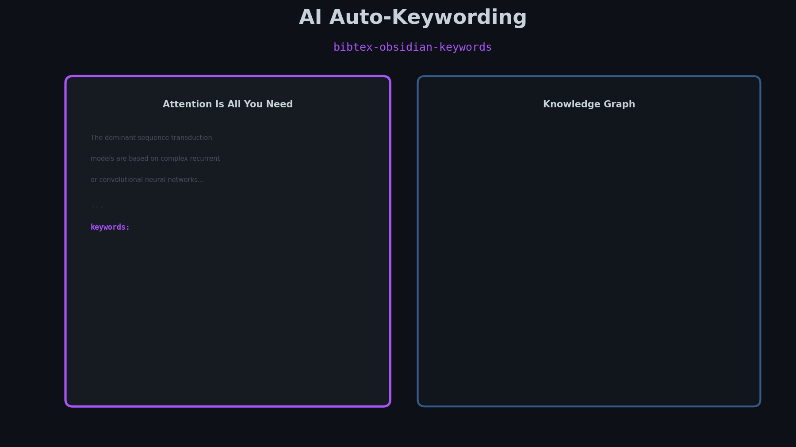
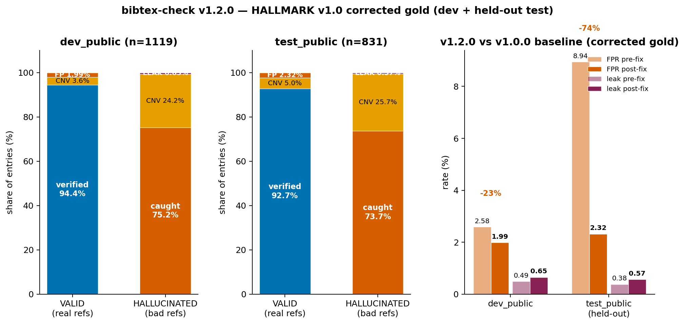

# BibTeX Updater

Tools for managing BibTeX bibliographies: automatically update preprints to published versions, validate references against external databases, and filter to only cited references.



## Installation

### From PyPI (Recommended)

```bash
pip install bibtex-updater

# With Google Scholar support
pip install bibtex-updater[scholarly]

# With Zotero support
pip install bibtex-updater[zotero]

# All optional dependencies
pip install bibtex-updater[all]
```

### From Source (Recommended)

```bash
git clone https://github.com/rpatrik96/bibtexupdater.git
cd bibtexupdater
uv sync --extra dev --extra all
```

### Using uv (No Installation)

Run directly without cloning using [uv](https://docs.astral.sh/uv/):

```bash
# Run any command directly
uv run --with "bibtex-updater[all]" bibtex-update references.bib -o updated.bib

# Or use the provided wrapper script
./scripts/bibtex-x update references.bib -o updated.bib
./scripts/bibtex-x check references.bib
./scripts/bibtex-x filter paper.tex -b references.bib -o filtered.bib
```

## CLI Commands

| Command | Description |
|---------|-------------|
| `bibtex-update` | Replace preprints with published versions |
| `bibtex-check` | Validate references exist with correct metadata |
| `bibtex-filter` | Filter to only cited entries |
| `bibtex-zotero` | Update preprints in Zotero library |
| `bibtex-zotero-organize` | Organize Zotero items into collections by research taxonomy |
| `bibtex-obsidian-keywords` | AI-powered keyword generation for Obsidian paper notes |

## Quick Start

### Update Preprints

```bash
# Update preprints to published versions
bibtex-update references.bib -o updated.bib

# Preview changes (dry run)
bibtex-update references.bib --dry-run --verbose
```

### Validate References (Fact-Check)

```bash
# Check if references exist and have correct metadata
bibtex-check references.bib --report report.json

# Strict mode: exit with error if hallucinated/not-found entries
bibtex-check references.bib --strict
```

### Filter Bibliography

```bash
# Filter to only cited entries
bibtex-filter paper.tex -b references.bib -o filtered.bib

# Multiple tex files
bibtex-filter *.tex -b references.bib -o filtered.bib
```

### Update Zotero Library

```bash
# Set credentials (get from zotero.org/settings/keys)
export ZOTERO_LIBRARY_ID="your_user_id"
export ZOTERO_API_KEY="your_api_key"

# Preview changes
bibtex-zotero --dry-run

# Apply updates
bibtex-zotero
```

### Sync BibTeX Updates to Zotero

When updating a `.bib` file, you can simultaneously update matching entries in your Zotero library:

```bash
# Set Zotero credentials
export ZOTERO_LIBRARY_ID="your_user_id"
export ZOTERO_API_KEY="your_api_key"

# Update bib file AND sync to Zotero
bibtex-update references.bib -o updated.bib --zotero

# Preview Zotero changes only (bib changes still apply)
bibtex-update references.bib -o updated.bib --zotero --zotero-dry-run

# Limit to a specific Zotero collection
bibtex-update references.bib -o updated.bib --zotero --zotero-collection ABCD1234
```

The sync matches bib entries to Zotero items by:
1. **arXiv ID** - Most reliable for preprints
2. **DOI** - For preprints with DOIs (e.g., bioRxiv)
3. **Title + Author** - Fuzzy matching as fallback

## Standalone Scripts

For environments without pip (e.g., Overleaf), `filter_bibliography.py` can be used directly as it has no dependencies:

```bash
# Copy the script and run directly
python filter_bibliography.py paper.tex -b references.bib -o filtered.bib
```

## Documentation

| Document | Description |
|----------|-------------|
| [docs/BIBTEX_UPDATER.md](docs/BIBTEX_UPDATER.md) | Full BibTeX updater documentation |
| [docs/REFERENCE_FACT_CHECKER.md](docs/REFERENCE_FACT_CHECKER.md) | Full reference fact-checker documentation |
| [docs/ZOTERO_UPDATER.md](docs/ZOTERO_UPDATER.md) | Full Zotero updater documentation |
| [docs/FILTER_BIBLIOGRAPHY.md](docs/FILTER_BIBLIOGRAPHY.md) | Full filter documentation |
| [docs/LANDSCAPE.md](docs/LANDSCAPE.md) | Databases, competing tools, and ecosystem landscape |
| [examples/](examples/) | Example workflows and configuration files |

## Overleaf Integration

Both tools integrate with Overleaf via GitHub Actions or latexmkrc.

### GitHub Actions (Recommended)

1. Enable GitHub sync in Overleaf (Menu -> Sync -> GitHub)
2. Copy a workflow from [examples/workflows/](examples/workflows/) to `.github/workflows/`
3. Changes synced from Overleaf automatically trigger updates

### latexmkrc (Direct Overleaf)

For `filter_bibliography.py` only (no dependencies required):

1. Upload `filter_bibliography.py` to your Overleaf project
2. Create `.latexmkrc` based on [examples/latexmkrc](examples/latexmkrc)
3. Recompile - filtered bibliography appears in your file list

## Features

### BibTeX Updater (`bibtex-update`)



- **Multi-source resolution**: arXiv, OpenAlex, Europe PMC, Crossref, DBLP, ACL Anthology, Semantic Scholar, Google Scholar
- **High accuracy**: Title and author fuzzy matching with confidence thresholds
- **ACL Anthology support**: Zero-overhead resolution for NLP papers (ACL, EMNLP, NAACL, etc.)
- **Batch processing**: Multiple files with concurrent workers (default: 8)
- **Deduplication**: Merge duplicates by DOI or normalized title+authors
- **Smart caching**: On-disk cache + semantic resolution cache with TTL
- **Per-service rate limiting**: Optimized rate limits per API (Crossref, S2, DBLP, ACL Anthology, arXiv, OpenAlex, Europe PMC)
- **Batch API support**: Faster bulk lookups via arXiv/S2/Crossref batch endpoints
- **Resolution tracking**: `--mark-resolved` tags updated entries to skip on re-runs

### Zotero Updater (`bibtex-zotero`)



- **Direct Zotero integration**: Fetches and updates items via Zotero API
- **Same resolution pipeline**: Uses the same multi-source resolution
- **Preserves metadata**: Keeps notes, tags, and attachments intact
- **Idempotent**: Already-published papers are automatically skipped
- **Dry-run mode**: Preview changes before applying
- **Tag-based chunking**: Track processing state with `preprint-upgraded`/`preprint-checked`/`preprint-error` tags

### Zotero Organizer (`bibtex-zotero-organize`)

- **AI-powered taxonomy**: Organize items into hierarchical collections automatically
- **Multiple backends**: Claude, OpenAI, or local embeddings for classification
- **Caching**: Classification results cached to reduce API calls
- **Batch processing**: Configurable limits and dry-run mode

### Obsidian Keywords (`bibtex-obsidian-keywords`)



- **AI-powered keywords**: Generate `[[wikilinks]]` for Obsidian paper notes
- **Multiple backends**: Claude, OpenAI, or local embeddings
- **Smart skipping**: `--min-keywords` to skip notes that already have enough keywords
- **Topics file**: Provide existing topics for consistent tagging across notes
- **Dry-run mode**: Preview changes before modifying files

### Reference Fact-Checker (`bibtex-check`)


**v1.2.0** carries v1.1.0's held-out FPR work into the *catch-rate* dimension: ~110 previously-abstained hallucinations are now flagged as `problematic`, the SCoRe wrong-venue leak class is caught, and a `--strict` evaluation mode tuned for [arXiv's 2026 hallucinated-reference policy](https://www.nature.com/articles/d41586-026-01595-5) (1-year ban followed by peer-review-first requirement) is available for high-stakes audits. Against the corrected HALLMARK v1.0 gold:

- **Held-out test FPR steady at 2.32%** (8.94% in v1.0.0 → 2.32% in v1.1.0+v1.2.0; **−74%** vs v1.0.0). Dev FPR 1.59% → 1.99% (+0.4pp; 3 small documented regression FPs)
- **Caught-on-hallucinated**: dev 60% → **75%**, test 58% → **74%** (+15pp on both splits) — driven by the new cross-source venue verification (catches SCoRe-shape leaks), the ID-anchored venue/year mismatch helper, and the relaxed-author retrieval fallback
- **Leak rate**: 0.65% dev (4 entries), 0.57% test (3 entries; SCoRe caught — was 4 in v1.1.0); policy-adjusted 0.32% / 0.38% — remaining "leaks" are mostly 1-character title perturbations; **hyphen-only differences are explicitly *not* counted as leaks in default mode** (hyphenation is bibliographic noise that varies across DBLP/Crossref/publisher records — flagging it would generate false positives on most legit refs). `--strict` catches every 1-char title diff (Levenshtein-1, hyphen included) for arXiv-style high-stakes audits, plus tolerance-0 year, single-source author-fab detection, and truncated-author flagging. See [docs/KNOWN_LEAKS.md](docs/KNOWN_LEAKS.md) for the per-leak enumeration and policy
- **Could-not-verify** on real refs dropped ~70% via venue + retrieval refinements (OpenReview/PMLR track-suffix normalization, TMLR/JMLR ISO-4 alias expansion, diacritic-preserving paperhash)

The "leak" headline is mostly benchmark noise: [HALLMARK PR #9](https://github.com/rpatrik96/hallmark/pull/9) corrects 30 entries — including **FlashAttention, DDPM, Imagen, SimCLR, Performers, ViT-vs-CNN, Chain-of-Thought (Wei), Zero-Shot Reasoner (Kojima), MERLOT** — that the v1.0 auto-labeller flagged as fabricated but are in fact real, correctly-cited papers (arXiv DOIs register with DataCite, not CrossRef, so the auto-labeller's "no resolve" check returned false). The corrected leak rate isolates genuine catch opportunities.



- **Multi-source validation**: Crossref, OpenAlex, DBLP, OpenReview, Semantic Scholar
- **Detailed mismatch detection**: Title, author, year, venue comparisons
- **Integrity checks**: DOI- and arXiv-ID-target consistency, ID-anchored author fabrication, chimeric-title detection
- **Hallucination detection**: Reserves `hallucinated` for positive evidence (fabricated DOI, future/invalid year, ID misattribution); abstains (`not_found`) on weak matches
- **Structured reports**: JSON and JSONL output formats
- **CI/CD integration**: Strict mode with exit codes for automation

#### Cascading verification

Inspired by [Abbonato 2026 (CheckIfExist)](https://arxiv.org/abs/2602.15871), verification runs a single cascade — CrossRef → OpenAlex → DBLP → OpenReview → Semantic Scholar — that short-circuits as soon as one source produces a high-confidence match (`≥0.95`). Each step retrieves top-K candidates and re-ranks them by title similarity; combined with cross-source author intersection, this catches swapped-author / chimeric citations that single-source verification misses.

The order is throughput-aware: CrossRef and OpenAlex (polite pool, ~100 req/min) come first, then DBLP and OpenReview (~30 req/min) as the CS-conference and ICLR/NeurIPS/TMLR authorities, so the slow keyless Semantic Scholar fallback (~10 req/min) is only reached on hard entries. Set a Semantic Scholar API key (`--s2-api-key` or `S2_API_KEY`) to lift S2 from ~10 to ~60 req/min.

OpenReview owns the submission record for most ML conferences, so it positively confirms ICLR/NeurIPS/TMLR papers that the DOI- and CS-index sources above can only leave in the "could-not-verify" bucket. Retrieval uses *fielded* title search (CrossRef `query.title`, OpenAlex `title.search`) rather than a free-text title+author blob, which keeps DOI-less ML-conference titles ranked correctly.

```bash
# Verification with top-3 candidates per source
bibtex-check references.bib --top-k 3 --jsonl out.jsonl

# Polite OpenAlex pool (recommended)
bibtex-check references.bib --openalex-mailto you@example.com
```

A 0–100 numeric `confidence_score` (additive in the JSONL output) summarizes per-field similarity with explicit penalty/bonus contributions:

- Multi-source bonus: `+10` when ≥2 sources confirm the same authors
- Penalties: title-mismatch `-20`, author-mismatch `-20`, journal-mismatch `-15`, fabricated-author `-10` each (capped at `-20`)
- Asymmetric formula for the high-title-low-author chimeric case: `confidence = S_title − 0.5 × (100 − S_author)`

#### Verdicts: verified vs. could-not-verify vs. problematic

`VERIFIED` requires every claimed field to be *positively confirmed* against the matched record — not merely "not contradicted". When a record is found but a claimed field can't be confirmed (e.g. a published venue backed only by a preprint, or an incomplete author list), the entry is reported as **could-not-verify** (`UNCONFIRMED`/`NOT_FOUND`), distinct from a **problematic** flag (`*_mismatch`, `doi_mismatch`, chimeric, …) which is positive evidence of a defect. A "could-not-verify" is *not* a clean pass: it means the tool couldn't decide, and such entries warrant review.

For full transparency, every residual `VERIFIED`-on-a-real-leak case against the corrected HALLMARK v1.0 gold is enumerated in [`docs/KNOWN_LEAKS.md`](docs/KNOWN_LEAKS.md), with the perturbation, the default verdict, and the `--strict` rule that catches it.

#### Author handling

All sources return authors in as-published order, so a *multiset-equal* reordering is treated as a real swapped-authors defect — *except* when the API record is alphabetized (Crossref NeurIPS/ICML proceedings deposits, prefix `10.52202`, sort contributors A–Z; that's a record-sort artifact, not a swap). Surname comparison uses each source's structured `family` field where available (Crossref, OpenAlex, OpenReview `~Given_Family` handles), so family-first/CJK names like "Chen Xing" ↔ "Xing Chen" match cleanly; when the matched source lacks structured names, a Crossref structured-name lookup vets a potential author mismatch before reporting it.

The **lead author's given name** is graded via `classify_given_pair`: diacritic / initial / abbreviation / nickname / transliteration variants pass; a true substitution (e.g. "Shunyu Zhou" vs canonical "Denny Zhou") flags as `GIVEN_NAME_SUBSTITUTION`. The **cross-source author-fabrication** check downgrades the author outcome to `AUTHOR_MISMATCH` when the entry contributes ≥2 surnames absent from every order-reliable candidate's full author set (no `and others` sentinel, ≥2 sources contributing), catching fabricated trailing authors that slip past the prefix-N slice. DBLP-scraped XML entities (`&apos;`, `&amp;`) are decoded before any matching, so `d'Amore`, `D'Hondt`, `Ch'ng` no longer trigger spurious mismatches.

#### Strict mode (`--strict`)

For high-stakes submissions where the asymmetric cost is leak ≫ FP — [arXiv as of May 2026 imposes a 1-year ban for incontrovertible hallucinated references, thereafter requiring submissions to be accepted by a reputable peer-reviewed venue first](https://www.researchinformation.info/news/arxiv-imposes-one-year-ban-for-unchecked-ai-generated-content/) — `--strict` (or `BIBTEX_CHECK_STRICT=1`) tightens the verdict gate:

- **Title:** Levenshtein-1 catches 1-character typos and added/removed hyphens (`"Privacy"`/`"Privacys"`, `"Schema Variable"`/`"Schema-Variable"`).
- **Year:** tolerance 0; a preprint-twin record returns `STRICT_WARN_PREPRINT_YEAR` instead of silently confirming.
- **Author-set:** even a single entry-side surname absent from a single complete canonical record flags `AUTHOR_MISMATCH` (the default requires ≥2 absent across ≥2 sources, to avoid false positives on stub records).
- **Author order:** the alphabetized-record escape is disabled — every same-multiset reordering on an order-reliable source flags.
- **Truncated author list without an `and others`/`et al` sentinel** flags `AUTHOR_TRUNCATED` (silent truncation is a misrepresentation; an explicit sentinel discloses it).

The companion `--strict-warn-cnv` subflag (requires `--strict`) promotes `unconfirmed`/`not_found` to a fourth visible category `STRICT_WARN_CNV`, so CI integrations can fail on entries the tool couldn't anchor. Default mode keeps the principled three-way verdict unchanged.

```bash
# Strict pass for an arXiv submission
bibtex-check references.bib --strict --strict-warn-cnv --jsonl strict.jsonl
```

#### Non-generative-AI mode (`--non-generative`)

For venue-policy compliance ([ACL ARR](https://aclrollingreview.org/reviewerguidelines#q-can-i-use-generative-ai), [ICML 2026](https://icml.cc/Conferences/2026/LLM-Policy)) the `--non-generative` flag (or `BIBTEX_CHECK_NON_GENERATIVE=1` env var) refuses to load any LLM backend at runtime. Today the package has no LLM backends, so this is a forward-compat guard plus a startup banner:

```bash
bibtex-check references.bib --non-generative --strict
# bibtex-check running in non-generative mode (no LLM calls).
# Compliant with ICML 2026 / ACL ARR LLM-in-review policies.
```

### Filter Bibliography (`bibtex-filter`)

- **Zero dependencies**: Uses only Python standard library
- **Works on Overleaf**: No pip install needed
- **Multiple bib files**: Merge and filter from multiple sources
- **Citation detection**: Supports natbib, biblatex, and standard LaTeX citations

## Python API

```python
from bibtex_updater import Detector, Resolver, Updater, HttpClient, RateLimiter, DiskCache

# Create HTTP client with rate limiting and caching
rate_limiter = RateLimiter(req_per_min=30)
cache = DiskCache(".cache.json")
http_client = HttpClient(
    timeout=30.0,
    user_agent="bibtex-updater/0.5.0",
    rate_limiter=rate_limiter,
    cache=cache
)

# Detect preprints
detector = Detector()
detection = detector.detect(entry)

if detection.is_preprint:
    # Resolve to published version
    resolver = Resolver(http_client)
    candidate = resolver.resolve(detection)

    if candidate and candidate.confidence >= 0.9:
        # Update the entry
        updater = Updater()
        updated_entry = updater.update_entry(entry, candidate.record, detection)
```

## Development

```bash
# Clone and install in development mode
git clone https://github.com/rpatrik96/bibtexupdater.git
cd bibtexupdater
uv sync --extra dev --extra all

# Run tests
uv run pytest tests/ -v

# Run tests with coverage
uv run pytest tests/ -v --cov=bibtex_updater --cov-report=term-missing

# Code quality
pre-commit run --all-files

# Build package
uv build

# Check package
uv run twine check dist/*
```

## License

MIT License - see [LICENSE](LICENSE) for details.
